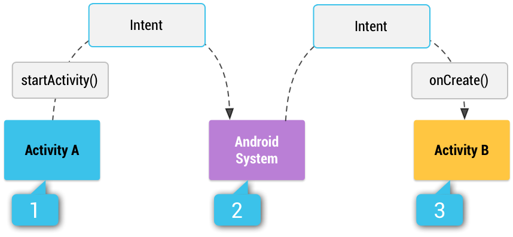

# Einführung

## Android Apps

Android Apps werden in Java oder Kotlin programmiert. Für spezielle hardwarenahme Teile einer App kann auch C/C++ verwendet werden (siehe [Android NDK](https://developer.android.com/ndk)). Eine Android App wird in eine APK-Datei (`.apk`) kompiliert, diese Datei kann dann zum Beispiel in einen Android App Market zur Veröffentlichung geladen werden.

Android ist ein Linux-basiertes Betriebssystem. Dabei gibt es einige wichtige Sicherheitsaspekte die daraus resultieren:

 - Jede App bekommt zum Installationszeitpunkt eine Linux User-ID zugewiesen. Nur diese User-ID hat Lese- und Schreibrechte innerhalb des App-Ordners.
 - Jede App wird grundsätzlich innerhalb eines eigenen Betriebssystem-Prozesses ausgeführt.
 - Jeder Prozess hat eine eigene Virtual Machine (Dalvik, ART), welche die App innerhalb einer Sandbox (isoliert von anderen Apps)ausführt.

### Grundstruktur einer Android App

Eine Android App besteht im Wesentlichen aus 3 Bestandteilen:

 - Jede App besitzt ein Manifest als zentrale Konfigurationsdatei in XML.
 - Anwendungskomponenten werden als Quellcode implementiert.
 - Apps benötigen auch Ressourcen, zum Beispiel:
     - Mediendateien (Bilder, Sound, Videos, …)
     - Texte (zB für Übersetzung in andere Sprachen)
     - Layout Definitionen in XML

Android Apps werden in eine APK-Datei (Android Package) kompiliert. Der Quellcode wird dabei im ersten Schritt in Java-Bytecode überführt und im weiteren über einen speziellen Compiler in `Dex Bytecode` überführt. Alle Ressourcen werden komprimiert und als `.arsc` Dateien in die APK verpackt. Ebenfalls wird das Manifest (`AndroidManifest.xml`) in die APK mit aufgenommen.


!!! info "Hinweis"
    Das kompilierte APK kann direkt weitergegeben werden oder über einen App Market veröffentlicht werden. Für die Veröffentlichung muss die APK signiert werden.

### Kernkomponenten in Android

Android Apps sind aus unterschiedlichen Kernkomponenten zusammengesetzt. Diese Kernkomponenten werden in Quellcode realisiert. Es können generell 4 Komponenten unterschieden werden:

 - **Activity:** Eine `Activity` repräsentiert einen „Screen“ einer App (Darstellung und Benutzerinteraktionen). Beispiel: Eine Email Anwendung hat eine `Activity`, welche das Verfassen der Email abwickelt.
 - **Service:** Längere Arbeitsschritte werden in `Services` ausgelagert und können so im Hintergrund ausgeführt werden. Beispiel: Abspielen von Musik (auch wenn die App geschlossen wird).
 - **Content Provider:** Verwalten globale Daten, welche für alle Apps relevant sind. Beispiel: Kontakte werden in einem `Content Provider` verwaltet.
 - **Broadcast Receiver:** Ereignisse, welche Systemweit kommuniziert werden, können über `Broadcast Receiver` abgefangen werden. Beispiel: Anwendungen können auf den "Low Battery" Event reagieren.

### Android Manifest

Jede Android App muss ein Manifest enthalten, welches unterschiedliche Metadaten über die App enthält. Das Manifest ist ein XML-Dokument im Wurzelverzeichnis der App mit Namen `AndroidManifest.xml`. Inhalte des Manifests sind folgende:

 - Alle Komponenten die zur App gehören
 - Definiert die öffentlichen Interaktionsmöglichkeiten für andere Apps
 - Definiert alle Berechtigungen, welche die App benötigt (zB Zugriff auf das Internet)
 - Kann alle Hardware-Features definieren, welchedie App benötigt (zB Kamera)
 - Weitere Metadaten wie App Name, App Icon, Versionsnummer, … 


```xml
<?xml version="1.0" encoding="utf-8"?>
<manifest xmlns:android="http://schemas.android.com/apk/res/android" package="fhku.exampleapp">
	
    <uses-permission android:name="android.permission.INTERNET" />

    <application        
        android:icon="@mipmap/ic_launcher"
        android:label="@string/app_name">
		
        <activity android:name=".MainActivity">
            <intent-filter>
                <action android:name="android.intent.action.MAIN" />
                <category android:name="android.intent.category.LAUNCHER" />
            </intent-filter>
        </activity>
    </application>
</manifest>
```

### Android API Level

Ein API Level klassifiziert die verfügbaren Funktionalitäten des Android Frameworks eindeutig. Erweiterungen der Framework API, welche durch eine neue Android Version eingeführt werden, sind additiv (Vorwärtskompatibel). Eine alte App (für alte Android Version entwickelt) funktioniert auf einer neuen Android Version.

Um eine Rückwärtskompatibilität sicher zu stellen, bietet Android sog. Support Libraries. Mit Support Libraries können neue Features auf alten Android Versionen hergestellt werden. Minimal, Maximal und Ziel API Level können für die jeweilige App innerhalb des Manifestes festgelegt werden.

### Support Libraries

Die unterschiedlichen Android Versionen sind unterschiedlich stark verbreitet. Android Apps sind vorwärtskompatibel. Eine App welche für das SDK 8.0 kompiliert wurde, funktioniert auch auf Android > 8.0 (8.1, 9.0, …).

Falls Features innerhalb einer Android App genutzt werden, welche zum Beispiel mit Android Version 6 eingeführt wurden, sind diese auf Android Geräte mit einer Version < 6 nicht nutzbar. Android Apps werden durch Support Libraries rückwärtskompatibel. Eine App welche mit Support Libraries entwickelt wird, kann auch auf älteren Android Versionen ausgeführt werden. Hierbei gibt es jedoch für jedes Feature auch eine untere Grenze!


## Wichtige UI-Konzepte

Android hat einige allgemeine Bedien-Konzepte die folgend kurz zusammengefasst werden.

#### Homescreen

Der Homescreen ist von der Benutzerin anpassbar, dort finden sich App Icons bzw. App Shortcuts. Es können auch sog. [`App Widgets`](https://developer.android.com/guide/topics/appwidgets/overview) eingefügt werden. Auch Ordner können erstellt werden zur besseren Organisation.


#### All-Apps Screen

Am All-Apps Screen finden sich alle Apps, welche am Smartphone installiert sind.


#### System Toolbars

 1. Die `Statusbar` zeigt `Notifications` und `Status Icons`.
 2. Die `Hauptnavigation` zeigt den `Zurückbutton` (siehe `Activities`), den `Homebutton` (zum Homescreen) bzw. `Recents` (zum Recents-Screen)

<div style="display:flex">
    
    
</div>

#### Recents Screen

Am Recents-Screen werden alle aktiven Apps bzw. Tasks gezeigt. Die Liste ist sortiert nach der letzen Nutzung.


## Activities

Für jede eigenständige Oberfläche einer Android App wird eine eigene `Activity` benötigt. Eine App besteht meist aus vielen `Activities`. Als einfache Regeln gelten:

 - Je komplexer eine App, desto mehr `Activities` werden benötigt.
 - Jede `Activity` sollte eine Benutzeraktion abdecken (zB Schreiben einer Email).

Eine App hat eine Start- oder Hauptactivity, welche beim Start der App (Klick auf Icon am `Homescreen`) ausgeführt wird. Für jede `Activity` wird eine `ContentView` definiert, welche den rechteckigen Bereich am Bildschirm definiert auf dem die Oberfläche der `Activity` gerendert wird.

`Activities` können so definiert sein, dass sie nur innerhalb der App nutzbar sind. Es gibt jedoch auch `Activities`, welche zur Nutzung für andere Apps geöffnet sein können.

### Organisation als Stack

Alle `Activities` (Ansichen oder Screens) einer App sind als Stack organisiert. Die oberste `Activity` im Stack befindet sich im Vordergrund und reagiert auf Benutzerinteraktionen.

Beim Start einer neuen `Activity` wird sie oben auf den Stack gelegt (push). Über den Zurück-Button am Smartphone/Tablet wird die oberste `Activity` vom Stack genommen (pop). Die Navigation über den Zurück-Button endet immer am `Homescreen`.


Eine App, welche in Ausführung gebracht wird, wird als `Task` bezeichnet und findet sich im `Recents-Screen`. Eine App wird immer innerhalb eines eigenen Prozesses ausgeführt. `Activities` einer App können auch innerhalb eines anderen Tasks (innerhalb einer anderen App) genutzt werden.

Zum Beispiel stellt Android eine allgemeine Kamera App zur Verfügung. Innerhalb einer anderen App, welche eine Kamera-Funktion benötigt, kann die `Activity` der allgemeinen Kamera App verwendet werden. Dies hat unter anderem den Vorteil, dass keine eigene Kamera Funktion implementiert werden muss.


### Lebenszyklus einer Activity

`Activities` sind an einen Lebenszyklus gebunden, welcher sich anhand der Sichtbarkeit einer Activity orientiert. Folgende Lebensphasen sind dabei definiert:

 - Aktive (vordergründige) Lebensphase
     - Die `Activity` ist sichtbar und wartet auf Benutzereingaben.
     - Übergänge in und aus dieser Lebensphase können häufig vorkommen. Die Methoden `onResume` und `onPause` sollen daher nur sehr leichtgewichtige Verarbeitungen durchführen.
 - Sichtbare Lebensphase
     - Transparente (zB unter einem Dialog) bzw. nicht aktive sichtbare Aktivität (zB Splitscreen)
     - Innerhalb der Methoden `onStart` und `onPause` bearbeiten
 - Gestoppte Lebensphase
     - `Activity` bleibt unsichtbar im Stack
     - Ressourcen sollen freigegeben werden innerhalb der Methode `onStop`. Zum Beispiel um Animationen zu stoppen, Sensoren freigeben oder GPS freigeben. Über die Methoden `onStart` bzw. `onRestart` können die Ressourcen wieder aktiviert werden.


## Intents

`Intents` sind ein sehr wichtiges Konzept in Android. Android Apps sind grundsätzlich nach dem Prinzip der losen Kopplung aufgebaut:

 - Jede Komponente hat eine klare Verantwortung und ist unabhängig von anderen Komponenten.
 - Komponenten kommunizieren über wohldefinierte Schnittstellen (Intents).
 - Komponenten werden dadurch systemweit wiederverwendbar. `Activities` (Fotos machen, SMS schreiben, E-Mail schreiben, Beiträge teilen, Telefonanruf durchführen, Kontakt auswählen) können in anderen Apps wiederverwendet werden.
 - Komponenten können isoliert getestet werden (Unit Test).

`Intents` werden zum Nachrichtenaustausch zwischen Komponenten verwendet. So kann eine `Activity` mit der Methode `startActivity` und als Parameter einen `Intent` eine neue `Activity` starten. Der `Intent` wird dabei an das Android Betriebssystem übergeben, dieses wählt die passende `Activity` aus.



### Arten von Intents

Es sind `explizite Intents` und `implizite Intents` in Android zu unterscheiden. Ein `expliziter Intent` wird verwendet um eine Komponente der eigene App zu identifizieren und zu starten. Ein `impliziter Intent` wird verwendet um eine Komponente einer anderen App zu identifizieren und zu starten.

Ein `expliziter Intent` gibt dabei den `FQN` (Fully-Qualified Classname) der Komponente an, um diese eindeutig zu identifizieren. Im folgenden Beispiel wird innerhalb eine `Activity` eine andere `GameActivity` gestartet:

```java
Intent intent = new Intent(this, GameActivity.class);
startActivity(intent);
```

Für `implizite Intents` kann kein `FQN` angegeben werden. Deshalb wird über Attribute spezifiziert, welche Funktionen und Eigenschaften eine Komponente erfüllen muss. Es werden dazu unterschiedliche Attribute verwendet:

 - **Action:** Eine abstrakte Beschreibung der Operation die ausgeführt werden soll. Zum Beispiel die `ACTION_DIAL` um einen Anruf zu tätigen.
 - **Data:** Eine Referenz auf die Daten auf denen die Aktion ausgeführt werden soll. Zum Beispiel kann über eine `URI` (`tel:123`) ein Kontakt angegeben werden.

Der `implizite Intent` wird potenziell von unterschiedlichen Komponenten erfüllt. Die Auswahl für die entsprechende Komponente wird letztlich der Benutzerin überlassen.


### Nachrichtenaustausch

Über `Intents` können auch Schlüssel/Wert Paare von einer Komponente an eine andere übertragen werden. Dazu werden sog. `Extras` verwendet.

Es soll von einer `Activity` eine andere `Activity` gestartet werden. Dabei soll ein Parameter `speed` übergeben wreden. Dieser Parameter steuert zum Beispiel die Geschwindigkeit innerhalb eines Spieles.

```java
Intent intent = new Intent(this, GameActivity.class);
intent.putExtra("speed", 350);
startActivity(intent);
```

Innerhalb des Ziels kann der `Intent` mit der Methode `getIntent` abgefragt werden. Dabei können die `Extras` genutzt werden. Es kann geprüft werden, ob ein entsprechendes `Extra` mit dem Schlüssel existiert (Methode `hasExtra`). Des Weiteren kann das `Extra` über eine typisierte Methode `getIntExtra` abgefragt werden. Ebenfalls kann ein Default-Wert angegeben werden (hier `500`).

```java
Intent intent = getIntent();
if (intent.hasExtra("speed")) {
    int speed = intent.getIntExtra("speed", 500);
}
```

## Logging

Um den Zustand einer App zu überwachen (Monitoring) oder auch zum Debugging kann unter anderem Logging verwendet werden. Eine Anwendung kann eigenständige Logfiles erzeugen und Ereignisse loggen. Logeinträge können eine Wichtigkeit bzw. Hierarchie aufweisen (RFC 5424):

 - **VERBOSE:** Lautes Logging
 - **DEBUG:** Wichtige Debugging Informationen
 - **INFO:** Wichtige Ereignisse der Anwendung
 - **WARN:** Ein unvorhergesehenes Ereignis
 - **ERROR:** Fehler in der Anwendung

Die Klasse Log mit den entsprechenden statischen Logging-Funktionen kann genutzt werden um Logs zu erzeugen. Zum besseren Auffinden im gesamten Log-Stream des Android Geräts können sog. TAGs eingesetzt werden. Über folgende Aufrufe können die entsprechenden Logs erzeugt werden:

```java
Log.v("MEINE APP", "Verbose Log-Nachricht");
Log.d("MEINE APP", "Debug Log-Nachricht");
Log.i("MEINE APP", "Info Log-Nachricht");
Log.w("MEINE APP", "Warn Log-Nachricht");
Log.e("MEINE APP", "Error Log-Nachricht");
```

### Log-Einträge in Logcat

In Android Studio können mit dem Programm `Logcat` die entsprechenden Log-Einträge gefunden werden:


### Beispiel: Activity-Übergänge loggen


## Weiterführende Details und Referenzen

 - **[Application Fundamentals](https://developer.android.com/guide/components/fundamentals):** Grundlagen zu Android Apps.
 - **[Android Manifest](https://developer.android.com/guide/topics/manifest/manifest-intro)**
 - **[Intro Activities](https://developer.android.com/guide/components/activities/intro-activities)**
 - **[Activity Lifecycle](https://developer.android.com/guide/components/activities/activity-lifecycle)**
 - **[Tasks und Stack](https://developer.android.com/guide/components/activities/tasks-and-back-stack)**
 - **[Intents](https://developer.android.com/guide/components/intents-filters)**

