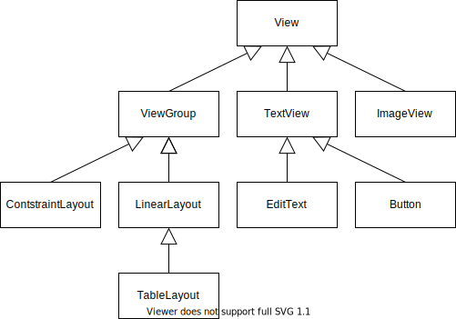
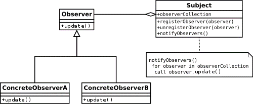

# Grafische Benutzeroberfläche

Eine grafische Benutzerschnittstelle in Android besteht aus 3 Bestandteilen:

 - Interaktionselementen die Benutzer der App sehen und damit interagieren können. In Android sind dies alle Klassen, welche von `android.view.View` erben (zB `Button`, `TextView`, …). 
 - Die Anordnung der Interaktionselemente (Layout) auf der jeweils verfügbaren Bildschirmfläche. In Android wird dies von Layout Managern übernommen. Alle Layout Manager (zB `LinearLayout`, `ConstraintLayout`, …) erben von der Klasse `android.view.ViewGroup`. Dabei erbt `ViewGroup` auch von `View`
 - Mechanismen zur Erkennung und der Reaktion auf Interaktionen der Benutzer (Eventhandling). In Android werden dazu Events erzeugt und von `EventListenern` abgearbeitet (zB `OnClickListener`).

## View Klassen-Hierarchie

Android liefert eine umfangreiche Bibliothek an GUI-Elementen. Dabei gibt es die Klasse [`android.view.View`](https://developer.android.com/reference/android/view/View), welche als Elternklasse aller `Views` fungiert. Neben der Klasse `View` gibt es die Klasse [`android.view.ViewGroup`](https://developer.android.com/reference/android/view/ViewGroup), welche zur Gruppierung von einzelnen `Views` verwendet wird.

Im folgenden findet sich ein kleiner Auszug aus der Android View-Klassen Hierarchie:



## View Instanzen-Hierarchie

Für die Realisierung der einzelnen Sichten innerhalb einer Android App werden die entsprechenden `Views` instanziert und über `ViewGroups` in eine Hierarchie verschachtelt. In der Benutzerschnittstelle nimmt eine Instanz der Klasse `View` einen rechteckigen Bereich ein. Auf diesem Bereich wird die `View` gezeichnet. Im Instanzen-Baum sind `Views` immer Blattknoten und `ViewGroups` bilden Teilbäume.

In der Darstellung wird eine Benutzerschnittstelle gezeigt und die zugehörige Hierarchie der View-Instanzen. Dabei ist ersichtlich das die `ContentView` das Wurzelelement ist. Jeder `Activity` ist eine `ContentView` zugeordnet, welche den gesamten rechteckigen Bereich angibt, der zur Verfügung steht um die Benutzerschnittstelle zu realisieren.


## Layouts in Android

Zur Anordung der Interaktionselemente auf der Benutzerschnittstelle werden Layouts verwendet. Diese können in Android entweder deklarativ durch die Definition eines XML-Dokumentes oder programmatisch über Quellcode erstellt werden. Ebenfalls eine Kombination aus deklarativen Teilen (eher für statische Teile des Layouts) und programmatischen Teilen (eher für dynamische Teile des Layouts) ist möglich.

In Android gibt eine große Anzahl unterschiedlicher Layouts. Im Prinzip sind alle Klassen, welche von `ViewGroup` erben als Layout nutzbar. Im Prinzip werden jedoch nur das `ContraintLayout` und das `LinearLayout` für die Darstellung jeglicher Layouts benötigt.

### LinearLayout

Das `LinearLayout` ist ein sehr einfaches aber effektives Layout. Es ordnet Kindelemente entweder vertikal oder horizontal in einer Reihe an. Des weiteren gibt es die zwei Eigenschaften `gravity` und `weight` um weitere Flexibiliät in der Anordnung von Elementen zu schaffen.

### Deklaratives LinearLayout Beispiel

Im folgenden wird ein `LinearLayout` definiert, welches die Kindelemente vertikal (von oben nach unten) in einer Reihe anordnet. Es ist ein horizontales Padding von `16dp` links und rechts definiert. Letzlich werden die Kindelemente durch die `gravity` Eigenschaft mit Wert `center` vertikal zentriert.

Bei den Kindelementen handelt es sich um 2 `Buttons`, welche als Text "1 Spieler" bzw. "2 Spieler" definiert haben. Sowohl für das `LinearLayout` als auch für die `Buttons` wird die Breite und Höhe über 2 spezielle Konstanten (`match_parent` und `wrap_content`) angegeben.

!!! info "Hinweis"
    Für jedes Element im Layout muss eine Breite und Höhe angegeben werden. Dabei können dort absolute Werte spezifiziert werden (zB 16dp). Besser als absolute Werte zu nutzen ist es auf vordefinierte Konstanten `match_parent` und `wrap_content` zurückzugreifen. `match_parent` errechnet dabei die Größte anhand des Elternelements (Sprich: so groß wie das Elternelement). `wrap_content` errechnet die Größe dabei anhand des Inhalts des Elements (Sprich: so groß wie nötig, dass der Inhalt des Elements dargestellt werden kann). Weitere Details dazu finden sich in der [Dokumentation](https://developer.android.com/guide/topics/ui/declaring-layout#layout-params).

```xml
<?xml version="1.0" encoding="utf-8"?>
<LinearLayout xmlns:android="http://schemas.android.com/apk/res/android"
    android:layout_width="match_parent"
    android:layout_height="match_parent"    
    android:paddingHorizontal="16dp"
    android:gravity="center"
    android:orientation="vertical">
    <Button        
        android:layout_width="match_parent"
        android:layout_height="wrap_content"
        android:text="1 Spieler" />
    <Button
        android:layout_width="match_parent"
        android:layout_height="wrap_content"
        android:text="2 Spieler" />
</LinearLayout>
```

In der Ansicht wird das gerenderte Layout angezeigt:


### ConstraintLayout

Durch die Verschachtelung unterschiedlicher `LinearLayouts` könnte man viele komplexe Layouts erzeugen. Dies ist jedoch nicht performant. Mit dem `ConstraintLayout` können können beliebig komplexe Layouts unter Einhaltung einer flachen Hierarchie erzeugt werden.

Das `ConstraintLayout` wird auch vom Designer in Android Studio umfassend unterstützt. Das `ConstraintLayout` ist ein sehr wichtiges und nützliches Layout für Android Apps, in der Lehrveranstaltung werden wir dieses jedoch nicht weiter verwenden.

## Eigenschaften von Views

`Views` besitzen Eigenschaften, welche das Erscheinungsbild oder das Verhalten der `View` bestimmen oder verändern.

Eine `TextView` hat zum Beispiel folgende Eigenschaften:

 - __Text:__ Der Text der in der `TextView` dargestellt werden soll
 - __Width:__ Die Breite der `TextView`
 - __Height:__ Die Höhe der `TextView`
 - __TextColor:__ Die Schriftfarbe des Textes

Alle Eigenschaften können entweder programmatisch über Getter- bzw. Setter-Methoden abgefrage und verändert werden. Innerhalb eines XML-Layouts können die Eigenschaften auch deklarativ über XML-Attribute gesetzt werden.

### Beispiel: Anpassung Eigenschaften

In der folgenden Ansicht wird eine Benutzeroberfläche gezeigt, welche 2 `Buttons` enhält. Der Text in den `Buttons` ist linksbündig, rot, fett und kursiv. Im Beispiel werden die Eigenschaften des ersten `Buttons` deklarativ und die Eigenschaften des zweiten `Buttons` programmatisch angepasst.


Im folgenden `LinearLayout` werden die 2 `Buttons` erzeugt. Zum zweiten `Button` werden über XML-Attribute die Eigenschaften `textAlignment`, `textColor` und `textStyle` deklariert:

```xml
<?xml version="1.0" encoding="utf-8"?>
<LinearLayout xmlns:android="http://schemas.android.com/apk/res/android"
    android:layout_width="match_parent"
    android:layout_height="match_parent"
    android:orientation="vertical">
    <Button
        android:layout_width="match_parent"
        android:layout_height="wrap_content"
        android:text="Button programmatisch"
        android:id="@+id/button1" />
    <Button
        android:layout_width="match_parent"
        android:layout_height="wrap_content"
        android:text="Button deklarativ"
        android:textAlignment="textStart"
        android:textColor="#FF0000"
        android:textStyle="bold|italic" />
</LinearLayout>
```

In der zugehörigen `Activity` wird der erste `Button` über die zugewiesene ID `button1` mit der Methode `findViewById` abgefragt. Die 3 Eigenschaften werden nun am `Button` Objekt über Setter zugewiesen.

```java
public class MainActivity extends AppCompatActivity {

    @Override
    protected void onCreate(Bundle savedInstanceState) {
        super.onCreate(savedInstanceState);
        setContentView(R.layout.activity_main);

        Button button1 = findViewById(R.id.button1);
        button1.setTextColor(Color.RED);
        button1.setTextAlignment(View.TEXT_ALIGNMENT_TEXT_START);
        button1.setTypeface(null, Typeface.BOLD_ITALIC);
    }
}
```

!!! info "Hinweis"
    In den meisten Fällen gibt es eine 1-zu-1 Übereinstimmung der Eigenschaftsbezeichnungen im XML-Layout bzw. im Quellcode. Es gibt jedoch einige Ausnahmen davon, zum Beispiel der `TextStyle` im obigen Beispiel.

## Eventhandling

Das Eventhandling in Benutzeroberflächen in Android Apps wird mit dem bekannten `Observer` Design Pattern durchgeführt.



Das `Subject` des Design Patterns wird von der Android `View` repräsentiert. Die entsprechenden `EventListener` nehmen die Rolle des `Observers` ein. Der Abauf in Android sieht dabei folgendermaßen aus:

 - Eine konkrete Implementierung des `Observers`, zum durch die Implementierung eines `OnClickListener` wird erstellt.
 - Der `Observer` wird an einem `Subject` registriert (zum Beispiel an einem `Button`).
 - Im `Subject` wird das entsprechende Event generiert (zum Beispiel eine Benutzerin klickt auf den `Button`) und alle registrierten `Observer` werden benachrichtigt.
 - Die registrierten `Observer` arbeiten das Event ab.

### Umsetzung des Eventhandling in Android

Innerhalb einer `Activity` können unterschiedliche Ansätze verwendet werden um das Eventhandling zu implementieren.

 - Deklarativ (eingeschränkt)
    - Innerhalb des XML-Dokumentes zum Layout kann an einer `View` das XML-Attribut `onClick` mit einer Methode der Activity verknüpft werden (Die Methode muss dafür eine bestimmte Signatur aufweisen).
 - Programmatisch
    - Die `Activity` selbst implementiert ein entsprechendes Interface und wird somit zum `EventListener`.
    - Eine eigene `EventListener` Klasse wird erstellt und implementiert:
        - Dies kann als eigene Klasse (in eigener Datei) durchgeführt werden.
        - Dies kann auch als innere Klasse der `Activity` durchgeführt werden.
    - Eine anonyme Klasse wird einmalig erstellt (Bei der Zuweisung des `EventListener`).
    - Ein Lambda-Ausdruck wird verwendet.

#### Deklarative Zuordnung

Innerhalb der `Activity` gibt es eine Methode mit beliebigen Name, aber einer vorgegebenen Signatur.

```java
public class MainActivity extends AppCompatActivity {
    // ...
	
    public void sayHello(View view) {
        Toast.makeText(this, "Hello", Toast.LENGTH_SHORT).show();
    }	
}
```

Im XML-Layout muss die entsprechende Methode an das XML-Attribut `onClick` als Wert übergeben werden. Dies führt dazu, wenn ein Klick auf dem `Button` ausgeführt wird, dass die Methode `sayHello` ausgeführt wird.

```xml
<Button
	android:id="@+id/button6"
	android:layout_width="wrap_content"
	android:layout_height="wrap_content"
	android:text="Hello"
	android:onClick="sayHello" />
```

!!! info "Hinweis"
    Die Methode innerhalb der Activity muss folgende Signatur aufweisen:

     - Die Methode muss `public` sein
     - Die Methode muss `void` als Rückgabe haben
     - Die Methode muss eine `View` als Übergabeparameter haben (dies ist die `View` welche geklickt wird)

Die deklarative Zuordnung ist eine sehr einfache Methode kann aber nur für Klick-Events verwendet werden.

#### Activity implementiert Interface

Die `Activity` implementiert das entsprechende Interface des `EventListeners`. Dadurch wird die `Activity` selbst zu einem `Observer`. Das `OnClickListener` Interface spezifiziert die Methode `onClick`, welche zu implementieren ist.

Im zweiten Schritt muss am entsprechenden `Subject`, hier ein `Button`, der `EventListener` zugeordnet werden. Da die `Activity` selbst den `EventListener` implementiert, wird dies durch übergabe von `this` durchgeführt.

```java
public class ExampleActivity extends Activity implements View.OnClickListener {

    @Override
    protected void onCreate(Bundle savedValues) {
        // ...
        Button button = findViewById(R.id.corky);
        button.setOnClickListener(this);
    }

    // Implementierung des OnClickListener Interface
    @Override
    public void onClick(View v) {
        // ...
    }    
}
```

Ein Nachteil dieser Methode ist, dass eine Activity nur eine Interface eines speziellen Typs implementieren kann. Es können nich zwei unterschiedlichen `OnClickListener` implementiert werden. 

#### Implementierung als eigene Klasse

Der entsprechende `EventListener` wird von einer eigene Klasse implementiert. Diese Klasse kann eine inner Klasse sein (wie im Beispiel unten) oder natürlich auch eine eigene Klasse innerhalb einer eigenen Datei.

Die Zuweisung der `EventListener` funktioniert durch die Erstellung einer eigenen Instanz der Klasse.

```java
public class ExampleActivity extends Activity {

    public class MyClickListener implements View.OnClickListener {

        @Override
        public void onClick(View view) {
            // ...
        }
    }
	
    @Override
    protected void onCreate(Bundle savedValues) {
        // ...
        Button button = findViewById(R.id.button);
        button.setOnClickListener(new MyClickListener());
    }
}
```

Der Vorteil dieser Variante ist, dass beliebig viele und unterschiedliche Implementierungen eines Event Typs erzeugt werden können. Die `EventListener` können auch in unterschiedlichen `Activities` wiederverwendet werden.

#### Implementierung als Anonyme Klasse

Ein `EventListener` kann natürlich auch als anonyme Klasse implementiert werden. Dabei wird die Implementierung an der Stelle durchgeführt an der auch die Zuweisung stattfinden.

```java
public class ExampleActivity extends Activity {

    @Override
    protected void onCreate(Bundle savedValues) {
        // ...
        Button button = findViewById(R.id.button);
        button.setOnClickListener(new View.OnClickListener() {
            public void onClick(View v) {
                // ...
            }
        });
    }
}
```

Der Nachteil dieser Methode ist, dass der `EventListener` nur einmal verwendet werden kann. Die Lesbarkeit von anonymen Klassen ist ebenfalls eingeschränkt.

#### Implementierung durch Lambda Ausdrücke

Lambdas wurden mit Java 8 eingeführt und sind auch in Android nutzbar. Lambdas sind Funktionen ohne Klassenkontext (Funktion steht für sich alleine) ohne innerhalb einer Klasse eingebettet zu sein. Lambdas können dabei wie Objekte genutzt werden (zB Übergabe als Parameter an andere Funktionen) und nach belieben ausgeführt werden.

Ein Lambda Ausdruck hat folgende Struktur:

```java
parameter -> expression
```

!!! info "Hinweis"
    Syntaktische Besonderheiten von Lambdas in Java:

     - Optionale Typ-Deklaration
     - Optionale Klammern bei einem Parameter
     - Optionale Klammern um Body, wenn nur ein Statement vorhanden ist
     - Optionales return-Schlüsselwort bei ungeklammertem Body

Lambdase können als Alternative zu anonymen Klassen verwendet werden. Die Lesbarkeit wird dadurch etwas erhöht:

```java
public class ExampleActivity extends Activity {

    @Override
    protected void onCreate(Bundle savedValues) {
        // ...
        Button button = findViewById(R.id.button);
        button.setOnClickListener((View view) -> {
            /* ... */
        });
    }
}
```

## Referenzen

 - **[Layouts](https://developer.android.com/guide/topics/ui/declaring-layout)**
 - **[LinearLayout](https://developer.android.com/guide/topics/ui/layout/linear)**: Wichtige Details zum `LinearLayout`.
 - **[ConstraintLayout](https://developer.android.com/training/constraint-layout)**: Wichtige Details zum `ConstraintLayout`.
