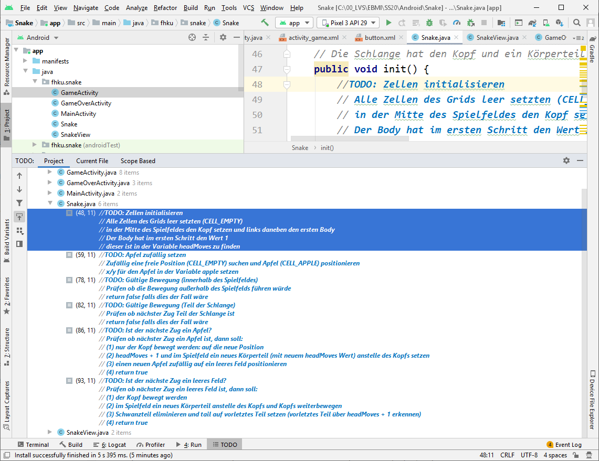

# Snake

## Projektübersicht

Für das Projekt werden 3 `Activities` benötigt. Jeder Screen der App wird über eine `Activity` realisiert. Für jede `Activity` muss auch ein eigenes Layout als XML erstellt werden.

<div style="display:flex">
    
    
    
</div>

Am Startscreen (`MainActivity`) finden sich 3 `Buttons`, welche jeweils über einen `Intent` die `GameActivity` starten. Dabei soll der `Intent` über ein `Extra` den Parameter `speed` übergeben. Der Parameter bestimmt dabei wie schnell sich die Schlange bewegen soll. Jenachdem welcher der 3 `Buttons` geklickt wurde, ist dies eben ein anderer Wert.

Die `GameActivity` enthält das entsprechende Spiel. Dabei soll eine eigene `View` implementiert werden, welche die Schlange enthält. Es gibt unten 4 `Buttons` welche die Bewegung der Schlange ermöglichen. Oben findet sich ebenfalls noch ein dynamisches Textfeld, welches für jede Bewegung, welche die Schlange macht um eins hochgezählt wird.

Falls das Schlange an den Rand oder an einen Teil ihres Körpers gespielt wurde, ist das Spiel beendet. In diesem Fall soll die `GameOverActivity` geöffnet werden. Im `Intent` soll ein `Extra` mit der Anzahl der `moves` übergeben werden. Diese sollen auch in der `GameOverActivity` angezeigt werden. Es gibt ebenfalls einen `Button` zum `Restart` des Spieles. Dieser soll zur `MainActivity` leiten (über einen `Intent`).

## Projekt clonen

Es steht eine Ausgangsbasis für das Projekt bereit. Dieses ist über Gitlab zu beziehen.



## Klasse Snake

Innerhalb der Klasse `Snake` befindet sich die gesamte Spiellogik.

```java
public class Snake {

    // Konstanten für die unterschiedlichen Werte, welche in Zellen
    // stehen können. Für den BODY der Schlange wird ein dynamischer
    // Wert errechnet: Der BODY wird in jedem Zug um eins erhöht  
    public static final int CELL_EMPTY = 0;
    public static final int CELL_APPLE = -1;
    public static final int CELL_HEAD = -2;

    // Die unterschiedlichen Änderungen, welche bei einem MOVE in
    // die entsprechende Richtung die Koordinate geändert werden
    // Zum Beispiel nach links wird die Koordinate x=-1 und y=0 geändert
    public static final int[] MOVE_LEFT = {-1, 0};
    public static final int[] MOVE_RIGHT = {1, 0};
    public static final int[] MOVE_UP = {0, -1};
    public static final int[] MOVE_DOWN = {0, 1};

    // 2-dimensionales Spielfeld
    public int[][] grid;

    // Änderungskoordinate in jeden Spielzug
    // diese wird durch die Methoden
    // moveUp, moveDown, moveLeft, moveRight verändert
    public int[] move = {1,0};

    // x/y Koordinate des Schlangenkopf
    public int[] head; 

    // x/y Koordinate des Hinterteils der Schlange
    public int[] tail; 

    // x/y Koordinate des Apfels
    public int[] apple; 

    // Jede Bewegung des Kopfes erhöht
    // diesen Wert um 1
    public int headMoves = 1;

    public Snake(int size) {
        grid = new int[size][size];
    }

    // Diese Methode initialisiert das Spielfeld
    // Die Schlange hat den Kopf und ein Körperteil
    public void init() {
        // TODO: Zellen initialisieren
        // Alle Zellen des Grids leer setzten (CELL_EMPTY)
        // in der Mitte des Spielfeldes den Kopf setzen und links daneben den ersten Body
        // Der Body hat im ersten Schritt den Wert 1
        // dieser ist in der Variable headMoves zu finden

        setApple();
    }

    // Diese Methode soll den Apfel zufällig setzen
    public void setApple() {
        // TODO: Apfel zufällig setzen
        // Zufällig eine freie Position (CELL_EMPTY) suchen und Apfel (CELL_APPLE) positionieren
        // x/y für den Apfel in der Variable apple setzen
    }

      

    // Diese Methode ist verantwortlich für die Durchführung des nächsten Spielzuges.    
    // Diese Methode liefert true zurück falls der Spielzug gültig war und erfolgreich
    // durchgeführt werden konnte. Diese Methode liefert false zurück wenn der Zug
    // ungültig wäre. Ein Rückgabewert false bedeutet auch, dass das Spiel verloren wurde
    public boolean next() {
        // der nächste Zug wird errechnet indem die aktuelle Position des head mit 
        // den Änderungskoordinaten in x und y Richtung addiert wird
        // moveX und moveY stellen die nächsten Koordinaten, wohin die Schlange 
        // wandern würde dar        
        int moveX = head[0] + move[0];
        int moveY = head[1] + move[1];

        // TODO: Gültige Bewegung (innerhalb des Spielfeldes)
        // Prüfen ob die Bewegung außerhalb des Spielfelds führen würde
        // return false falls dies der Fall wäre
        
        // TODO: Gültige Bewegung (Teil der Schlange)
        // Prüfen ob nächster Zug Teil der Schlange ist
        // return false falls dies der Fall wäre

        // TODO: Ist der nächste Zug ein Apfel?
        // Prüfen ob nächster Zug ein Apfel ist, dann soll:
        // (1) nur der Kopf bewegt werden: auf die neue Position
        // (2) headMoves + 1 und im Spielfeld ein neues Körperteil (mit neuem headMoves Wert) anstelle des Kopfs setzen
        // (3) einen neuen Apfel zufällig auf ein leeres Feld positionieren
        // (4) return true
        
        // TODO: Ist der nächste Zug ein leeres Feld?
        // Prüfen ob nächster Zug ein leeres Feld ist, dann soll: 
        // (1) der Kopf bewegt werden
        // (2) im Spielfeld ein neues Körperteil anstelle des Kopfs und Kopfs weiterbewegen
        // (3) Schwanzteil eliminieren und tail auf vorletztes Teil setzen (vorletztes Teil über headMoves + 1 erkennen)
        // (4) return true
        
        return false;
    }

    public void moveUp() {
        move = MOVE_UP;
    }

    public void moveDown() {
        move = MOVE_DOWN;
    }

    public void moveLeft() {
        move = MOVE_LEFT;
    }

    public void moveRight() {
        move = MOVE_RIGHT;
    }
}
```

## Eigene View Klasse

Die Klasse `SnakeView` ist eine quadratische `View` und zeichnet das Spielfeld. Zum entsprechenden Interval wird die Methode `draw` aufgerufen mit dem Spielfeld aus der Klasse `Snake`. Innerhalb der Methode `onDraw` wird dann das Spielfeld auf der bereitgestellten `Canvas` neu gezeichnet.

```java
public class SnakeView extends View {

    protected Paint paintBackground;
    protected Paint paintSnakeBody;
    protected Paint paintSnakeHead;
    protected Paint paintApple;

    protected int[][] grid;

    public SnakeView(Context context, @Nullable AttributeSet attrs) {
        super(context, attrs);

        // TODO: Zeichenstifte erzeugen
        // die 4 Zeichenstifte (Paint) sollen erzeugt werden:
        // Background=Grün, Apfel=Rot
        // Schlangenkopf=Dunkelgrau, Schlangenkörper=Hellgrau
    }

    public void draw(int[][] grid) {
        this.grid = grid;

        // Durch den Aufruf der Methode invalidate, wird das
        // Neuzeichnen der View zum nächsten möglichen Zeitpunk gefordert
        // Wann dies genau passiert wird dann vom Betriebssystem entschieden
        invalidate();
    }

    @Override
    protected void onMeasure(int widthMeasureSpec, int heightMeasureSpec) {
        // in dieser Methode wird festgelegt, dass die View immer
        // eine quadratische Grundfläche hat, hier muss nichts verändert werden
        int parentWidth = MeasureSpec.getSize(widthMeasureSpec);
        setMeasuredDimension(parentWidth, parentWidth);
    }

    @Override
    protected void onDraw(Canvas canvas) {
        // Eine invalidierte View wird nach Vorgabe vom Betriebssystem neu gezeichnet
        // dafür wird die Methode onDraw aufgerufen und eine Canvas übergeben
        // Das Canvas hat die Methode getWidth bzw. getHeight um die verfügbare
        // Größe zu errechnen, die Größe einer Zelle kann dadurch errechnet werden
        
        // TODO: Spielfeld zeichnen
        // (1) Der Hintergrund soll als Rechteck gezeichnet werden
        // (2) Der Apfel als Roter Kreis
        // (3) Der Kopf als Dunkelgrauer Kreis
        // (4) Alle Körperteile als Hellgrauer Kreis
    }
}
```

## GameActivity Layout

Die Klasse `SnakeView` kann wie folgt im XML-Layout integriert werden. Es kann an allen Rändern eine Margin gesetzt werden. Falls der Hintergrund des Layouts Schwarz ist, entsteht der schwarze Rand um das Spielfeld (Ersichtlich im Screenshot).

```xml
<fhku.snake.SnakeView
    android:id="@+id/snake_view"
    android:layout_width="match_parent"
    android:layout_height="wrap_content"
    android:layout_marginStart="8dp"
    android:layout_marginTop="8dp"
    android:layout_marginEnd="8dp"
    android:layout_marginBottom="8dp" />
```

Die `Buttons` zur Steuerung des Spiels können als `ImageButtons` erzeugt werden. Die Symbole, welche sich auf den `Buttons` befinden wurden als Vektorgrafiken bereitgestellt. Die 4 `Buttons` können dabei die selbe Grafik verwenden, müssen diese nur rotieren (Siehe Eigenschaft `rotation`). Dei 4 `Buttons` sollen dabei innerhalb eines horizontalen `LinearLayouts` gesetzt werden.

```xml
<ImageButton
    android:id="@+id/button_left"
    android:layout_width="wrap_content"
    android:layout_height="wrap_content"
    android:layout_weight="1"
    android:background="#00FF00"
    android:rotation="180"
    app:srcCompat="@drawable/button" />
```
