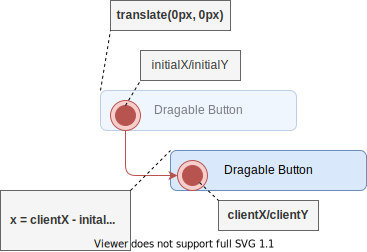

# Draggable Grid

In diesem Projekt soll ein `Responsive Grid` erstellt werden, welcher sich an die gegebenen Bildschirmgrößen anpasst. Die Anordnung der Elemente des Grid sollen über Drag und Drop verändert werden können. Das Projekt soll sowohl für Desktops als auch für Smartphones nutzbar sein.

<video controls style="max-width: 720px">
    <source src="../videos/draggable-grid.m4v" type="video/mp4">
</video>

## Projekt Setup

Erstellen Sie einen leeren Projektordner auf Ihrem Rechner die Bennenung ist grundsätzlich egal, jedoch `draggable-grid` würde sich anbieten.

Innerhalb des Ordners erstellen Sie eine Datei `package.json`. Als Inhalt der Datei fügen Sie 2 geschweifte Klammern ein:

```json
{}
```

Installieren Sie einen Web-Server zur lokalen Entwicklung mit `npm i http-server --save-dev`. Nach der Installation können Sie ein `script` in der Datei `package.json` hinzufügen um den Web-Server zu starten. Das finale `package.json` sollte folgenden Inhalt aufweisen:

```json
{
  "scripts": {
    "start": "http-server docs -p 8080"
  },
  "devDependencies": {
    "http-server": "^0.12.3"
  }
}
```

Es soll noch ein Ordner `docs` erstellt werden, welcher alle Projektdateien enhält. Durch die Ausführung von `npm start` kann nun die lokale Entwicklung begonnen werden.

!!! info "Hinweis"
    Für ein Deployment auf Github Pages sollten alle Dateien, welche zur App gehören im Ordner `docs` liegen. Dieser Ordner wird dann über einen Web-Server öffentlich bereitgestellt.

## HTML/CSS

Die Benutzerschnittstelle ist sehr einfach gehalten. Im folgenden findet sich das HTML-Dokument und das zugehörige CSS-Stylesheet um das Responsive Grid zu erstellen.

```html
<!DOCTYPE html>
<html lang="en">
<head>
    <meta charset="UTF-8">
    <meta http-equiv="X-UA-Compatible" content="IE=edge">
    <meta name="viewport" content="width=device-width, initial-scale=1.0">
    <title>Draggable Grid</title>
    <link rel="stylesheet" href="style.css">    
</head>
<body>
    <h1>Draggable Grid</h1>
    <ul>
        <li data-index="1">One</li>
        <li data-index="2">Two</li>
        <li data-index="3">Three</li>
        <li data-index="4">Four</li>
        <li data-index="5">Five</li>
        <li data-index="6">Six</li>
    </ul>
</body>
</html>
```

```css
body {
    font-family: sans-serif;
    margin: 0;
}

h1 {
    font-size: 18px;
    text-align: center;
}

ul {
    padding:20px;
    display: grid;
    grid-template-columns: repeat(auto-fit, minmax(280px, 1fr));    
    column-gap: 15px;
    row-gap:15px;
    justify-content: center;    
}

@media (min-width: 992px) {
    ul {
        grid-template-columns: repeat(3, minmax(200px, 400px));
    }
}

li {
    list-style: none;
    padding: 10px;
    border-radius: 5px;
    border: 1px solid DarkTurquoise;
    background: LightCyan;
    cursor: grab;
}
```

Diese beiden Quellcodeabschnitte sind jeweils in die Datei `docs/index.html` bzw. `docs/style.css` zu kopieren.


## Draggable

Um HTML-Elemente als `draggable` zu definieren, reicht es grundsätzlich aus, dass Attribut `draggable` und den Wert `true` zu setzen. Dies soll für die `li` Elemente durchgeführt werden:

```HTML
<li draggable="true" data-index="1">One</li>
<li draggable="true" data-index="2">Two</li>
<li draggable="true" data-index="3">Three</li>
<!-- ... -->
```

## Drag Events

HTML-Elemente die als `draggable` definiert sind, erzeugen wichtige Events, welche über JavaScript abfragbar sind. In der folgenden Tabelle sind die wichtigsten Events aufgeführt. Als `Target` wird das HTML-Element bezeichnet, welches sich im JavaScript Event in der Eigenschaft `target` befindet.

| Event | Target | Beschreibung |
| --- | --- | --- |
| drag | Gezogenes HTML-Element | Dieses Event wird alle paar Millisekunden getriggert, wenn das HTML-Element von der Benutzerin gezogen wird. Wichtige Eigenschaften wie die x/y Koordinaten des Mauszeigers befinden sich in diesem Event |
| dragstart | Gezogenes HTML-Element | Die Benutzerin beginnt die Drag and Drop Operation |
| dragend | Gezogenes HTML-Element | Die Benutzerin beendet die Drag and Drop Operation (zum Beispiel loslassen des Mouse-Button am Desktop) |
| dragenter | `Drop-Target` HTML-Element | Die Benutzerin zieht ein `draggable` HTML-Element über ein `Drop-Target` |
| dragleave | `Drop-Target` HTML-Element | Die Benutzerin zieht ein `draggable` HTML-Element aus dem Bereich eines `Drop-Target` |
| dragover | `Drop-Target` HTML-Element | Falls die Benutzerin ein `draggable` HTML-Element über ein `Drop-Target` zieht, wird alle paar Millisekunden das `dragover` Event mit genauen x/y Koordinaten der Mauszeiger erzeugt |
| drop | `Drop-Target` HTML-Element | Dieses Event wird erzeugt, wenn die Drag and Drop Operation auf einem `Drop-Target` beendet wird |

!!! info "Hinweis"
    Ein HTML-Element wird grundsätzlich zum `Drop-Target`, wenn es das Attribut `draggable` besitzt.

### Drag Start und Drag End

Zur Demonstration des `dragstart` bzw. `dragend` Events soll eine CSS-Klasse auf dem HTML-Element gesetzt werden, welches sich in einer Drag and Drop Operation befindet.

Dazu soll im ersten Schritt die CSS-Klasse `dragged` im CSS-Stylestheet hinzugefügt werden:

```css
/* ... */
.dragged {
    opacity: 30%;
}
```

Zusätzlich soll eine `index.js` Datei erzeugt werden, welche das notwendige JavaScript enthält. Die JavaScript Datei soll über ein `script` Tag im HTML-Head eingebunden werden:

```html
<!-- ... -->
<head>
    <!-- ... -->
    <script defer src="index.js"></script>
</head>
<!-- ... -->
```

Als Inhalt der JavaScript Datei soll folgendes hinzugefügt werden:

```javascript
const draggableItemsContainer = document.querySelector('ul');

draggableItemsContainer.addEventListener('dragstart', (e) => {
    e.target.classList.add('dragged');
});
draggableItemsContainer.addEventListener('dragend', (e) => {
    e.target.classList.remove('dragged');
});   
```

Im Skript wird das Elternelement der `draggable` HTML-Elemente selektiert. Es wird der EventListener `dragstart` oder `dragend` gesetzt, welcher die CSS-Klasse `dragged` am Event Target setzt oder entfernt.

### Drag Enter und Drag Leave

Am `Drop-Target` soll ebenfalls eine CSS-Styleänderung durchgeführt werden, wenn eine Drag and Drop Operation über dem HTML-Element durchgeführt wird. Es soll die CSS-Klasse `dragover` erstellt werden. Diese CSS-Klasse soll über die Events `dragenter` bzw. `dragleave` am `Drop-Target` "getoggled" werden.

```css
/* ... */ 
.dragover {
    border: 1px dotted OrangeRed;
    background: Coral;
}
```

Die Änderung der CSS-Klasse soll dabei nur durchgeführt werden, wenn das Event Target ein `index` Attribut im `Dataset` definiert hat. Dies wurde für alle `draggable` HTML-Elemente bereits definiert. Ansonsten würden alle möglichen HTML-Elemente, über welche das HTML-Element gezogen wird mit der CSS-Klasse ausgestattet.

```javascript
// ...
draggableItemsContainer.addEventListener('dragenter', (e) => {
    if (e.target.dataset.index) {
        e.target.classList.add('dragover');
    }    
});
draggableItemsContainer.addEventListener('dragleave', (e) => {
    if (e.target.dataset.index) {
        e.target.classList.remove('dragover');
    }
});  
```

### Drag Over und Drop

Damit das entsprechende Drop Event ausgeführt wird und die HTML-Elemente entsprechend getauscht werden, müssen EventListener für `dragover` und `drop` hinzugefügt werde. Damit das `drop` Event korrekt ausgeführt wird, muss für das `dragover` Event die Function `preventDefault` ausgeführt werden. Nur in diesem Fall erlaub der Web-Browser `drop` Events.

Um im `drop` Event, welches auf dem `Drop-Target` ausgeführt wird, das gezogene HTML-Element anzufragen, soll im `dragstart` der `data-index` vom gezogenen HTML-Element innerhalb des [DataTransfer](https://developer.mozilla.org/en-US/docs/Web/API/DataTransfer) Objektes mitgeben werden.

!!! info "Hinweis"
    Das `DataTransfer` Objekt könnte zB auch eine Datei enthalten, welche am Desktop vom Datei-Explorer in den Web-Browser gezogen wird (per Drag and Drop).

Im `datastart` Event soll am entsprechenden `DataTransfer` Objekt über die Methode `setData` der `data-index` des gezogenen HTML-Elements hinzugefügt werden. Die `setData` Methode verlangt als ersten Parameter den Mime-Type des 2. Parameters. In diesem Fall handelt es sich um Plaintext. Falls es sich um ein Bild handeln würde, könnte zB `image/jpg` als Mime-Type angegeben werden.

Im `drop` Event kann dann der Wert, welcher im `DataTransfer` Objekt gesetzt wurde wieder abgefrag werden. Somit können beide Indizes (vom gezogenen HTML-Element und vom `Drop-Target`) abgefragt werden. Mit den beiden Indizes Werten kann im folgenden die Änderung im DOM vorgenommen werden, sodass eben die beiden HTML-Elemente ausgetauscht werden.

```javascript
draggableItemsContainer.addEventListener('dragstart', (e) => {
    e.dataTransfer.setData('text/plain', e.target.dataset.index); // data-index
    e.target.classList.add('dragged');
});
// ...
draggableItemsContainer.addEventListener('dragover', (e) => {
    e.preventDefault();
});
draggableItemsContainer.addEventListener('drop', (e) => {
    e.preventDefault();
    const index1 = e.dataTransfer.getData('text/plain');
    const index2 = e.target.dataset.index;
    // TODO: HTML-Elemente tauschen
});
```

## Aufgabe 1a:

Das HTML-Element, welches gerade gezogen wird, soll beim `dragenter` Event die CSS-Klasse `dragover` nicht gesetzt bekommen.

## Aufgabe 1b:

Im `drop` Event wurde ein `TODO` hinterlegt, welches die beiden über die entsprechenden `data-index` Attribute identifizierbaren HTML-Elemente tauschen soll. Erstellen Sie dazu eine globale Funktion `swapItems`, welche die beiden Indizes `index1` und `index2` übergeben bekommt. Die Funktion soll dann die beiden HTML-Elemente im DOM austauschen. Dabei sollte nicht nur der Textinhalt getauscht werden, sondern tatsächlich die HTML-Elemente.

> *__Hinweis:__ Für die DOM-API gibt es eine Vielzahl hilfreicher Funktionen, welche generell für Änderungen im DOM verwendet werden können. Im konkreten Fall, gibt es Funktionen wie zB `insertAdjacentElement`, `appendChild` oder `removeChild`, welche hier nützlich sein können. Ebenfalls gibt es zum jeweiligen DOM-Knoten (aka HTML-Element) wichtige und nützliche Attribute, im konkreten Fall zum Beispiel `previousElementSibling` oder `nextElementSibling`.* 

## Ausführung am Smartphone

Wenn die Web-Applikation auf Github gestellt wird und dort über Github Pages deployed wird, wird ersichtlich, dass das Drag and Drop nicht am Smartphone funktioniert. Leider funktioniert die aktuelle Implementierung nur für Desktop Browser, dass hätte man vielleicht am Beginn des Tutorials bereits erwähnen sollen :face_with_rolling_eyes:.

### Touch Events

Der Web-Browser ist multitouchfähig. Das bedeutet, dass jeder Finger am Display einzeln abgebildet werden kann. Jeder Finger ist als `Touch` Objekt repräsentiert. Am `Touch` Objekt wird über die Eigenschaften `clientX` bzw. `clientY` die Koordinaten des Fingers am Display angegeben.

Ensprechend des Verhaltens der Finger am Display sind unterschiedliche Events definiert:

| Event | Beschreibung |
| --- | --- |
| touchstart | Ein Finger ist auf das Display gelegt worden, am entsprechenden HTML-Element wird das `touchstart` Event ausgelöst |
| touchend | Ein Finger ist vom Display entfernt worden, am entsprechenden HTML-Element wird das `touchend` Event ausgelöst |
| touchmove | Ein Finger am Display wird bewegt |
| touchcancel | Der Touch-Vorgang wurde unsachgemäß beendet, zum Beispiel wurde der Finger über das Display hinausgezogen |

### HTML-Element bewegen (Touch-basiert)

Ähnlich zum klassischen Drag and Drop werden für das Touch Handling die EventListener ebenfalls am Elternelement `ul` gesetzt. 

Im ersten Schritt ist es wichtig zu verstehen, wie ein HTML-Element bewegt werden kann. Eine effiziente Form kann über die CSS-Eigenschaft `transform` mit dem Wert `translate(x,y)` durchgeführt werden. Dies kann eben unter anderem über JavaScript durchgeführt werden. Folgender Javascript Quellcode würde ein bestehendes HTML-Element 15px nach rechts und 15px nach oben verschieben. Wählen Sie dazu ein beliebiges HTML-Element einer Website über die Web-Entwickler Werkzeuge aus und fügen Sie in der Konsole folgendes JavaScript ein:

```javascript
$0.style.transform = "translate(15px, -15px)";
```

Wichtig zu verstehen ist, dass der Platz an dem das HTML-Element vor dem Transformationsschritt gezeichnet wurde frei bleibt. Die umliegenden HTML-Element füllen den leeren Platz nicht auf. Das transformierte HTML-Element überdeckt die umliegenden HTML-Elemente. Aus diesem Grund ist generell nur die `Composite` Phase des Rendering Vorgangs im Web-Browser notwendig.

Die Bewegung über JavaScript würde so enstehen, dass bei jedem `touchmove` Event die x/y Koordinaten für die Transformation am zu bewegenden HTML-Element (`translate(x, y)`) angepasst wird. Die `x` bzw. `y` Werte für die `translate` Funktion sollen dabei immer als Differenz zum initialen Wert der x/y Koordinaten des Touch Events gesetzt werden. Dies ist soll hoffentlich über die unten angeführte Grafik verständlich gemacht werden:



Der gesamte Drag and Drop Quellcode aus den vorangegangenen Abschnitten soll innerhalb einer Funktion `initDragAndDrop` hinterlegt werden. Die von Ihnen entwickelte globale Funktion `swapItems` soll nicht innerhalb der `initDragAndDrop` gesetzt werden, diese wird auch im Touch Handling wiederverwendet. Vorerst soll nur die `initTouch` Funktion ausgeführt werden.

```javascript
function initDragAndDrop() {
    const draggableItemsContainer = document.querySelector('ul');

    // ...
    // Drag and Drop Quellcode aus dem vorangegangenen Abschnitten
    // hier einfügen
}

function initTouch() {
    const draggableItemsContainer = document.querySelector('ul');
    let initialX = 0;
    let initialY = 0;
    
    draggableItemsContainer.addEventListener('touchstart', (e) => {        
        initialX = e.touches[0].clientX;
        initialY = e.touches[0].clientY;
    });
    draggableItemsContainer.addEventListener('touchmove', (e) => {
        const x = e.touches[0].clientX - initialX;
        const y = e.touches[0].clientY - initialY; 
        e.target.style.transform = "translate(" + x + "px, " + y + "px)"; 
    });
    draggableItemsContainer.addEventListener('touchend', (e) => {
        e.target.style.transform = "translate(0px, 0px)";
    });
}

initTouch();
```

Mit dem `touchstart` Event sollen die initialen x/y Koordinaten des Fingers gespeichert werden. Zu jedem `touchmove` Event soll die Transformation des HTML-Elements über die Differenz der initialen Position des Fingers zur aktuellen Position des Fingers berechnet werden. Im `touchend` Event soll die Transformation wieder auf ihren Ursprungszustand zurückgesetzt werden.

### HTML-Element tauschen (Touch-basiert)

Um das Tauschen der HTML-Elemente durchzuführen, muss im `touchend` Event das HTML-Element detektiert werden, welches unterhalb des Fingers liegt (aka `Drop-Target` im Fall von Drag and Drop). Dazu gibt es die hilfreiche DOM-API Funktion `document.elementsFromPoint(x, y)`. Mit dieser Funktion kann über die Angabe einer beliebigen x/y Koordinate das entsprechende HTML-Element, welches sich an dieser Position befindet abgefragt werden.

Dazu wird eine Variable `lastX` bzw. `lastY` eingeführt. Diese wird innerhalb jedes `touchmove` Events gesetzt. Damit können wir im `touchend` die letzte Position des Fingers (als er noch am Display war) bestimmen. Mit der Funktion `elementsFromPoint` und den letzten bekannten x/y Koordinaten kann letzlich das HTML-Element, welches in als `Drop-Target` fungiert bestimmt werden. Der gesamte Quellcode der `initTouch` Funktion findet sich nun unten:

```javascript
function initTouch() {
    const draggableItemsContainer = document.querySelector('ul');
    let initialX = 0;
    let initialY = 0;
    let lastX = 0;
    let lastY = 0;
    
    draggableItemsContainer.addEventListener('touchstart', (e) => {
        initialX = e.touches[0].clientX;
        initialY = e.touches[0].clientY;
    });
    draggableItemsContainer.addEventListener('touchmove', (e) => {
        const x = e.touches[0].clientX - initialX;
        const y = e.touches[0].clientY - initialY; 
        lastX = e.touches[0].clientX;
        lastY = e.touches[0].clientY;
        e.target.style.transform = "translate(" + x + "px, " + y + "px)"; 
    });
    draggableItemsContainer.addEventListener('touchend', (e) => {
        const elementList = document.elementsFromPoint(lastX, lastY)
        if (elementList.length > 1 && elementList[1].hasAttribute('draggable')) {
            // die swapItems Funktion wurde bereits in Aufgabe 1b von Ihnen erstellt
            swapItems(e.target.dataset.index, elementList[1].dataset.index);
        }        
        e.target.style.transform = "translate(0px, 0px)";
    });
}

initTouch();
```

Um die Funktionalität des Touch-Handlings ähnlich zum Drag and Drop herzustellen, müssen noch einige Kleinigkeiten gelöst werden. Dazu sollen die Aufgaben 2a, 2b und 2c abgearbeitet werden. 

## Aufgabe 2a:

Mit dem `touchstart` soll die CSS-Klasse `dragged` am gezogenen HTML-Element gesetzt werden. Mit dem `touchend` Event soll diese Klasse wieder entfernt werden. Dies soll einen ähnlichen Effekt zeigen wie im Drag and Drop Beispiel.

## Aufgabe 2b:

Die CSS-Klasse `dragover` soll ebenfalls bei den HTML-Elementen gesetzt werden, über welche das gezogenen HTML-Element fährt. Dabei muss im `touchmove` Event das HTML-Element bestimmt werden, über das gerade gezogen wird. Dazu kann wiederum die bekannte Funktion `elementsFromPoint` verwendet werden. Es gibt kein `dragenter` bzw. `dragleave` Event, welches im Touch-Handling verfügbar ist. Sie müssen sich eine entsprechende Logik überlegen, wie innerhalb des `touchmove` Events die CSS-Klasse `dragover` gesetzt bzw. entfernt wird, sodass der entsprechende Effekt gewährleistet ist.

## Aufgabe 2c:

Am Smartphone bzw. Tablet soll im JavaScript die Funktion `initTouch` ausgeführt werden, sodass das Drag and Drop funktioniert. Am Desktop bzw. Laptop soll die Funktion `initDragAndDrop` ausgeführt werden. Die entsprechenden Funktionen müssen also konditional geladen werden, jenachdem welche Funktionen der Web-Browser unterstützt (Touch-Handling oder Drag and Drop). Recherchieren Sie einen geeigneten Weg um dies zu bewerkstelligen. 
